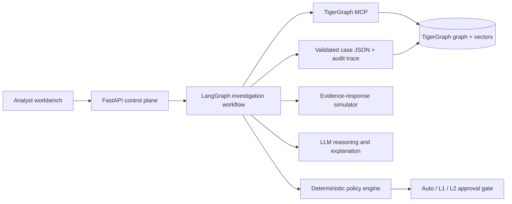

# FraudLens

FraudLens is an uncertainty-aware fraud investigation agent for the TigerGraph × Hacker House Goa challenge. It turns a fraud signal, customer report, or analyst request into a traceable investigation, a policy-compliant next-best action, and a complete case record backed by TigerGraph evidence.

This repository currently contains the researched architecture and delivery plan. Implementation starts only after the benchmark contract, policy invariants, graph schema, and evaluation gates are fixed.

## What makes the approach strong

- **Graph-first investigation:** bounded GSQL traversals find transaction sequences, shared devices, region clusters, connected cards, and prior cases.
- **Evidence before prose:** every material claim is stored with a reproducible graph-path receipt and real entity IDs before the LLM writes a conclusion.
- **Explicit uncertainty:** the agent separates missing-evidence uncertainty from conflicting-evidence uncertainty and asks only for evidence that could change the action.
- **Policy as code:** exact challenge actions, approval routes, and rules R1–R10 are enforced by a deterministic policy engine.
- **Case memory:** completed cases are written back to the graph, but benchmark-era memory is time-gated to prevent future-case leakage.
- **Calibrated decisions:** probabilities are fitted and checked on chronological history; structural signals inform the decision but never become certainty by themselves.
- **Reproducible outputs:** each answer records dataset, policy, prompt, model, query, and run versions alongside latency, tool-call, and token metrics.

## System at a glance

## Read in this order

1. [Problem brief](docs/01-problem-brief.md)
2. [Product and judging strategy](docs/02-product-strategy.md)
3. [System architecture](docs/03-system-architecture.md)
4. [Data and graph model](docs/04-data-and-graph-model.md)
5. [Agent workflow](docs/05-agent-workflow.md)
6. [Policy, safety, and explainability](docs/06-policy-safety-explainability.md)
7. [Evaluation plan](docs/07-evaluation-plan.md)
8. [Analyst interface specification](docs/08-ui-ux-spec.md)
9. [Delivery roadmap](docs/09-delivery-roadmap.md)
10. [Research notes](docs/10-research-notes.md)
11. [Demo storyboard](docs/11-demo-storyboard.md)

Architecture decisions live in [docs/decisions](docs/decisions/README.md). The canonical repository map is in [docs/00-repository-map.md](docs/00-repository-map.md).

## Required benchmark contract

- Produce `outputs/cases/HHG-001.json` through `HHG-020.json`.
- Use only IDs present in the supplied dataset.
- Write every created case back to TigerGraph.
- Record initial and final actions, including the approval route and what changed after requested evidence.
- Generate a SAR only when the challenge policy requires one.
- Preserve the complete evidence and decision trail.

## Current status

- Challenge PDF read and cross-checked against the dataset README.
- Dataset contents, policy rules, 20-case contract, and exact answer shape identified.
- Current TigerGraph MCP, GraphRAG, graph-fraud, temporal-leakage, calibration, human-oversight, LangGraph, and FinCEN guidance researched.
- Implementation-ready repository architecture and two-day delivery sequence documented.
- Source code and benchmark data intentionally deferred until the architecture review is complete.

## External prerequisites

- TigerGraph Savanna workspace or Community Edition
- Python 3.12+ for the backend and agent services
- Node.js 22+ for the analyst workbench
- An LLM provider API key
- Git and a GitHub repository before the first implementation commit

Never commit credentials or the raw benchmark CSV files. Copy `.env.example` to `.env` locally when implementation begins.
