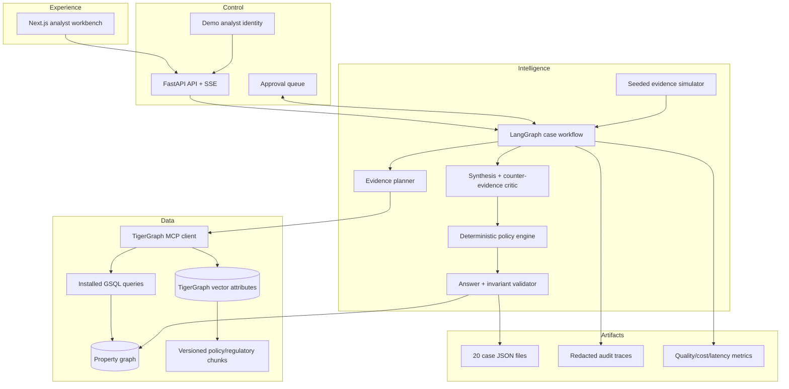
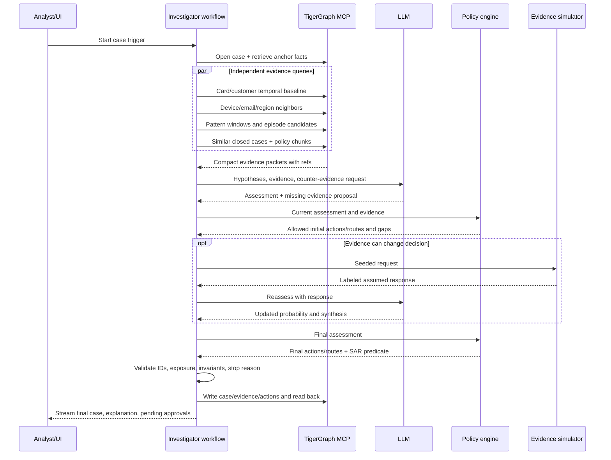

# System architecture

## Architectural stance

FraudLens uses one stateful investigator with specialized deterministic tools. A multi-agent swarm would add coordination cost, latency, and inconsistent policy interpretation during a two-day build. The workflow can still parallelize independent graph retrievals, but one case state remains authoritative.

TigerGraph is the investigation and memory system of record. LangGraph owns orchestration and durable pause/resume behavior. The policy engine owns permissions and routing. The LLM owns bounded planning, evidence synthesis, hypothesis comparison, and explanation.

## Logical architecture

## Component responsibilities

| Component | Responsibility | Key boundary |
|---|---|---|
| Analyst workbench | Show case progression, evidence graph, uncertainty, actions, approvals, and export | Never receives database/model secrets |
| API | Start/resume runs, stream events, serve compact graph data, persist approvals | Contains no fraud-detection logic |
| Investigator workflow | Maintain case state, select tools, evaluate evidence sufficiency, stop | Cannot authorize L1/L2 actions |
| TigerGraph MCP | Stable tool boundary for schema, installed queries, nodes/edges, vector search | Prefer installed read queries over raw arbitrary GSQL at runtime |
| Policy engine | Apply R1–R10, routes, thresholds, case/report/stop invariants | Deterministic; no model calls |
| Evidence simulator | Return reproducible assumed evidence for benchmark requests | Labels every response simulated; never uses hidden truth |
| Answer validator | Enforce schema, ID membership, arithmetic, cross-field consistency | Blocks persistence/export on error |
| TigerGraph | Source for graph evidence, closed-case memory, knowledge chunks, completed cases | All writes are idempotent and read back |

## Decision ownership

| Decision | Owner | Recorded proof |
|---|---|---|
| Which bounded evidence to retrieve | Investigator workflow | Plan, allowed tool, parameters, cutoff, query version |
| What the evidence supports | Investigator synthesis | Evidence ledger, competing hypotheses, source-family independence |
| Which actions and routes are valid | Deterministic policy engine | Triggered predicates and policy version |
| Whether an L1/L2 action proceeds | Named analyst | Approval or rejection, rationale, evidence viewed, timestamp |
| Whether an output can ship | Validator | Schema/invariant report and graph readback receipt |

## Runtime sequence

## Deployment choice for the hackathon

- TigerGraph Savanna for the graph and vector store, with auto-stop/auto-start enabled as the brief requests.
- Use TigerGraph 4.2+ when available. The current TigerGraph MCP project requires 4.1+ and recommends 4.2+ for TigerVector and advanced hybrid retrieval.
- Web, API, workflow, policy engine, and MCP client run on the demo laptop for the lowest deployment risk.
- TigerGraph MCP uses `stdio` for the single-user demo. Its official project describes `stdio` as the normal single-user mode and reserves streamable HTTP for a shared multi-user server.
- If a hosted demo is needed, deploy web/API together and place an authenticated gateway in front of a streamable-HTTP MCP service; do not expose MCP directly.

## Technology choices

| Layer | Choice | Reason |
|---|---|---|
| Graph + vectors | TigerGraph Savanna | Required platform, graph traversal, installed GSQL, vector attributes, MCP support |
| Agent workflow | Python LangGraph | Explicit state graph, checkpointing, retries, interrupts, human approval, easy TigerGraph MCP integration |
| API | FastAPI + SSE | Typed Python boundary and simple live progress stream |
| Web | Next.js + TypeScript | Fast dashboard development and strong component ecosystem |
| Graph visualization | Cytoscape.js | Focused evidence subgraphs, layouts, selection, tooltips |
| Contracts | Pydantic on backend; generated TypeScript types | One canonical answer model and early validation |
| Tests | pytest + Playwright | Domain invariants, graph integration, and demo path |
| Observability | Structured JSON trace plus optional LangSmith | Full local replay without making a hosted service mandatory |

## Reliability patterns

- Every case uses a stable `case_id` and `run_id`; writes use deterministic IDs to make retries idempotent.
- Every derived feature and graph query is evaluated `as_of` the case cutoff; the feature registry stores source fields, formula, version, and maximum event time used.
- Enable TigerGraph MCP tool-call logging and expose only the tool subset required by the investigator and persistence adapter.
- Graph/MCP calls get bounded retry policies and timeouts; semantic failures return to the planner with structured error evidence.
- Checkpoints occur after intake, evidence collection, assessment, evidence request, policy decision, and graph writeback.
- A run cannot claim success until the final JSON validates and the graph case is read back.
- Analyst overrides append a decision event with the prior recommendation, resulting action, reason, and evidence snapshot; they never rewrite the model recommendation.
- The UI shows partial evidence and the last completed checkpoint instead of inventing completion.

## Trust boundaries

Retrieved documents and graph text are evidence, not instructions. Tool names and parameters are allow-listed. Raw GSQL mutation is disabled in the runtime investigator. Only the persistence adapter writes graph state. Model-generated IDs, dollar totals, action routes, and policy citations are recomputed or validated server-side.
