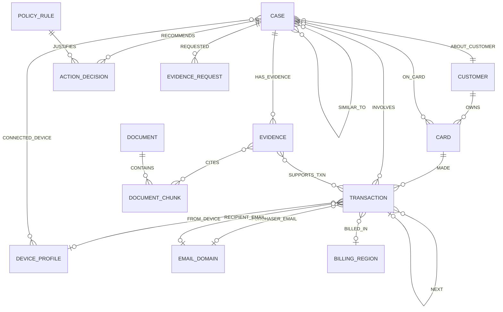

# Data and graph model

## Modeling goals

The graph must answer investigation questions quickly, preserve the official IDs, support case memory, and make every output claim traceable. It should not turn all 400+ CSV columns into vertices. High-cardinality raw and engineered features remain transaction/identity attributes; entities and relationships that drive traversal become vertices and edges.

## Core graph schema

## Vertex design

| Vertex | Primary ID | Important attributes | Purpose |
|---|---|---|---|
| `Customer` | supplied `customer_id` | first/last activity, card count, baseline aggregates | Investigation anchor |
| `Card` | derived supplied-format `card_id` | raw `card1`–`card6`, card type, first/last observed activity | Transaction sequence and exposure scope |
| `Transaction` | supplied `TransactionID` as string | timestamp, amount, product, channel, region, risk score, selected feature groups | Atomic financial event |
| `DeviceProfile` | deterministic hash of normalized DeviceInfo + OS + browser + screen | readable profile, device status, proxy category | Cross-card identity link |
| `EmailDomain` | normalized domain | role/count statistics | Purchaser/recipient relationship signal |
| `BillingRegion` | normalized `addr1` code | country code when available | Regional behavior and shared-origin analysis |
| `Case` | official case ID or deterministic historical/agent case ID | times, source, status, verdict, probability, pattern, exposure, summary, trust tier | Case memory and audit root |
| `Evidence` | deterministic `case_id:sequence` | claim, source, ref, collected_at, direction, strength | Claim-level provenance |
| `EvidenceRequest` | deterministic `case_id:request_no` | type, step, assumed response, simulator version | Before/after decision trace |
| `ActionDecision` | deterministic `case_id:stage:order` | stage, action, route, reason, state, approval actor/time | Initial/final action and approval audit |
| `Document` | content hash | title, issuer, source URL, retrieved date, version | Knowledge provenance |
| `DocumentChunk` | content hash + chunk index | text, section, embedding, token count | GraphRAG retrieval unit |
| `PolicyRule` | `R1`…`R10` plus case/report/stop rules | exact text, policy version | Stable policy citation |

`ClosedCase` from the suggested schema is represented as `Case` with `source=closed_history` and `trust_tier=labeled_history`. This unifies memory retrieval while preserving provenance. The 20 benchmark cases use `source=benchmark` and a lower trust tier until their simulated investigation finishes.

### Card ID derivation

The source profile proves that `card1` is customer-level and cannot identify `K1/K2`. Derive the supplied card IDs by grouping each customer on raw `card6`, sorting distinct values lexically with the empty value retained, and assigning `K1` onward. The rule matches all 1,913 historical mappings and all 20 exam anchors. See [ADR-0006](decisions/0006-card-identity-derivation.md) and the [source data profile](15-source-data-profile.md).

Store the mapping as a versioned staging artifact and assert it during load. A Card vertex also stores `observed_from`; case-time queries must not reveal a card or activity before it was first observed.

## Important edges

| Edge | Direction | Important attributes |
|---|---|---|
| `OWNS` | Customer → Card | observed-from/to |
| `MADE` | Card → Transaction | timestamp |
| `FROM_DEVICE` | Transaction → DeviceProfile | new/found flag, proxy flag |
| `PURCHASER_EMAIL`, `RECIPIENT_EMAIL` | Transaction → EmailDomain | — |
| `BILLED_IN` | Transaction → BillingRegion | timestamp |
| `NEXT` | Transaction → Transaction | seconds gap; same card |
| `ABOUT_CUSTOMER`, `ON_CARD`, `INVOLVES` | Case → entity | role, affected flag |
| `CONNECTED_DEVICE` | Case → DeviceProfile | evidence ID, link count |
| `SIMILAR_TO` | Case → Case | semantic, structural, and fused scores; retrieval time |
| `HAS_EVIDENCE` | Case → Evidence | order, hypothesis direction |
| `RECOMMENDS` | Case → ActionDecision | initial/final stage |
| `REQUESTED` | Case → EvidenceRequest | requested step |
| `SUPPORTS_TXN` | Evidence → Transaction | support/counter relation |
| `CITES` | Evidence → DocumentChunk | retrieval score |
| `JUSTIFIES` | PolicyRule → ActionDecision | rule version |

## Attribute strategy

- Preserve all official columns in raw files and make them available for audited lookup.
- Put frequently filtered, readable features directly on `Transaction` and `DeviceProfile`.
- Keep unnamed `V*`, `C*`, `D*`, `M*`, and numeric `id_*` features as signals with their original names. Never assign invented semantics.
- Create stable derived attributes only when their formula is documented, versioned, and testable: hour/day, absolute amount, time since previous transaction, new-region flag, device-card fan-out, card velocity, and baseline deviation.
- Register every derived feature with its formula, source columns/edges, version, `as_of` rule, and latest event timestamp consumed. A feature is invalid if its lineage crosses the case cutoff.
- Treat centrality, fan-out, component, proximity, and similarity as contextual evidence. They never imply fraud without transaction, identity, behavioral, or verification evidence.
- Use strings for external IDs even when the CSV renders them as integers, preventing accidental numeric rewriting.

## Evidence path receipt

Each graph evidence item stores a compact receipt:

- installed query name and semantic version;
- normalized parameter hash and decision-time cutoff;
- graph snapshot/loading manifest hash;
- ordered vertex/edge IDs for each supporting path;
- returned aggregate values and result hash;
- feature lineage/version when a derived value is cited.

Receipts are compact enough to persist with the case and sufficient to rerun the query. Human-facing explanations link to them; raw unrestricted graph responses do not enter the prompt.

## Loading plan

1. Verify all source files against `data/source-manifest.json` and the accepted data profile.
2. Materialize the validated `(customer_id, card6) → card_id` mapping, then load Customer, Card, Transaction, `OWNS`, and `MADE`.
3. Load identity rows and derive deterministic DeviceProfile IDs.
4. Load email/region vertices and transaction edges.
5. Build `NEXT` edges ordered by card and timestamp.
6. Load historical cases, their transaction/card links, actions, reports, notes, and embeddings.
7. Load policy, typology, and approved regulatory document chunks with provenance.
8. Install queries, run count and referential-integrity checks, then take a clean graph snapshot.

Rejected rows are written to a local report with file, row number, field, reason, and hash. A load is not accepted unless counts reconcile: accepted + rejected = source rows.

## Installed investigation query contracts

| Query | Inputs | Compact result |
|---|---|---|
| `get_case_anchor` | case/transaction/card/customer IDs | Canonical trigger and exact entity attributes |
| `get_card_window` | card ID, anchor time, before/after hours, limit | Ordered transactions, gaps, amounts, channels, regions, devices |
| `get_customer_baseline` | customer ID, cutoff time | Historical amount/channel/product/region/device distributions |
| `detect_card_testing` | card ID, cutoff/window | Tiny-authorization sequences and following purchases |
| `detect_cnp_burst` | card ID, cutoff/window | Online bursts, novelty, amount deviation, device flags |
| `detect_region_anomaly` | card/customer ID, cutoff/window | Novel in-person regions, duration, concurrent home activity |
| `detect_account_takeover` | customer ID, cutoff/window | Mixed-channel/device/match anomalies across cards |
| `get_shared_origin_ring` | device/region/email, cutoff/window, hop limit | Connected cards, transactions, historical fraud links |
| `get_episode_candidates` | anchor transaction, max hours/hops | Candidate affected transactions with reasons |
| `get_correlated_case_triggers` | customer/card/device/origin, cutoff/window | Nearby alerts/cases that may represent the same incident, with no automatic merge |
| `get_prior_cases_structural` | evidence signature, cutoff, limit | Labeled cases sharing entities/pattern features |
| `get_case_graph` | case ID, node/edge limits | UI-ready evidence subgraph |
| `write_case_bundle` | validated case bundle | Idempotent case/evidence/request/action graph write |
| `verify_case_bundle` | case ID, run ID | Persisted IDs/counts/hash for readback |

All read queries require a cutoff timestamp. Historical queries cannot see transactions or cases later than the case's decision time. UI graph queries enforce node/edge limits.

## GraphRAG retrieval

The retrieval pipeline produces no more than a small evidence packet:

1. Structural candidates from graph entities, sequences, and prior cases.
2. Semantic candidates from embeddings over historical notes/summaries, policy, typologies, and regulatory guidance.
3. Metadata filters for time, source/trust tier, document version, and pattern.
4. Fusion and diversity re-ranking so near-duplicate chunks do not crowd out counter-evidence.
5. Citation objects containing source ID, section/query ref, score, and entity IDs.

Policy chunks can explain a rule, but the policy engine evaluates the rule. Regulatory chunks can improve a SAR narrative, but they cannot change the challenge thresholds.

### Initial chunking and tuning plan

TigerGraph's current GraphRAG guidance recommends fixing retrieval quality bottom-up: chunking, entity/relationship extraction, retrieval, and only then response prompts. FraudLens starts with:

- Markdown-aware chunks of about 2,048 characters with 256-character overlap for policy and narrative prose.
- Larger 4,096–8,192-character chunks for regulatory tables so headers and rows stay together.
- Domain extraction instructions that keep concrete cases, accounts/cards, transactions, devices, filings, risks, and policy rules while excluding page numbers, navigation, headers, and captions.
- Retrieval defaults near `top_k=5` and `num_hops=2` for relational questions, always bounded by source, time, trust tier, and result count.
- A fixed 5–10 question retrieval evaluation set; change one parameter at a time and retain only improvements.

These are starting values, not hidden constants. The winning configuration is versioned with its evaluation evidence.

## Leakage and temporal integrity

- Closed historical cases are visible only after their `closed_at` timestamp.
- Each benchmark investigation uses a cutoff at its own opened time.
- When benchmark memory is enabled, cases run in opened-time order; only already completed earlier cases are retrievable.
- Benchmark-derived memory carries `trust_tier=agent_derived`, never `labeled_history`.
- Evaluation also runs each case from the clean base snapshot to measure whether sequential memory changes results.
- Offline graph features are recomputed in time-respecting snapshots or excluded from scored runs; full-graph values calculated after the cutoff are never backfilled into a case.
- Chronological tests insert a distinctive future edge and assert that every query, feature, retrieval route, and explanation remains unchanged before its timestamp.

## Scale expectations

The dataset is moderate for TigerGraph but wide. Loading and queries should select only necessary columns. The main online investigation path uses bounded traversals around a trigger rather than whole-graph algorithms. Connected components/community detection belong to offline optional monitoring, with results stored as derived attributes for fast investigation use.
