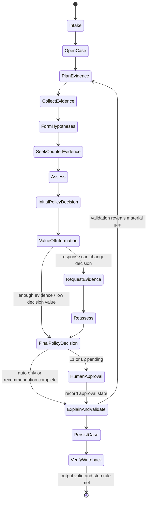
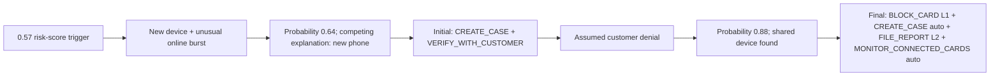

# Agent workflow

## State model

One typed case state is checkpointed throughout the run. Its major sections are:

- trigger and canonical entity IDs;
- run metadata and temporal cutoff;
- hypotheses and competing explanations;
- graph/document evidence ledger;
- counter-evidence ledger;
- episode candidates and exposure calculation;
- structural and semantic prior cases;
- probability, confidence, and calibration metadata;
- uncertainty type (`missing_evidence`, `conflicting_evidence`, or both) and unresolved predicates;
- initial action recommendation;
- evidence requests and assumed responses;
- final action recommendation and approval state;
- SAR decision and narrative inputs;
- stop reason, output validation, and graph-write receipt.

Prose is a derived view. Raw tool results and normalized evidence remain available for replay.

## State machine

## Node responsibilities

### 1. Intake

Validate trigger type and supplied IDs against the case pack, establish the decision-time cutoff, initialize counters/timers, and reject any case whose anchor transaction/card/customer relationship cannot be confirmed.

### 2. Open case

Create an idempotent open Case vertex with run metadata. This is a preliminary record, not `written_to_graph=true` for the final answer.

### 3. Plan evidence

Generate a short plan using trigger type and anchor facts. The plan names questions, not conclusions: What happened around the transaction? Is the device/region new? Does activity continue normally? Are other cards linked? Which historical cases are comparable?

### 4. Collect evidence

Run independent bounded queries concurrently where safe. Normalize each result into an evidence candidate with a source reference, involved entities, timestamp, and direction (`supports_fraud`, `supports_legitimate`, or `context`).

### 5. Form hypotheses

Score the documented patterns, `undocumented`, and `none`. The agent must keep at least one plausible alternative until evidence rules it out. It identifies the likely episode boundary and candidate affected transactions.

### 6. Seek counter-evidence

Query specifically for evidence against the leading hypothesis. This phase is mandatory before a final fraud conclusion and skipped only when customer denial already directly settles an unauthorized transaction but still runs for episode scope and connections.

### 7. Assess

Produce a probability and evidence sufficiency assessment using a versioned rubric calibrated against chronological historical cases. The model explains feature contributions but cannot directly copy `risk_score` or a network score as the probability. Record calibration version, the pre-calibration score, calibrated probability, uncertainty type, and evidence source families.

Suggested probability bands:

| Probability | Interpretation | Default posture |
|---:|---|---|
| 0.00–0.15 | Strong legitimate evidence | Close when at least two independent pieces support it |
| 0.16–0.29 | Likely legitimate but unresolved | Monitor/verify if an action could change |
| 0.30–0.69 | Material uncertainty | Create case; request high-value evidence; R8 if exposed/conflicted |
| 0.70–0.84 | Strong suspicion | Act per pattern/policy, but check evidence independence |
| 0.85–1.00 | High-confidence fraud | Stop when two independent pieces support it and scope is known |

The bands guide behavior; exact policy rules take precedence.

### 8. Initial policy decision

Pass normalized facts to the deterministic policy engine. It returns permitted actions, exact routes, triggered rules, missing predicates, and whether a case or SAR is required. This becomes `next_best_actions.initial`.

### 9. Value-of-information gate

Request more evidence only when one or more plausible responses would change a decision. Before issuing it, run each allowed response through assessment and policy as a side-effect-free preview. Store an outcome table containing resulting probability band, actions/routes, SAR predicate, and stop condition. Choose the request with the best combination of decision impact, customer friction, latency, and policy relevance. Record why other requests were not chosen.

### 10. Request evidence

For this benchmark, call the seeded simulator for exactly one of `customer_validation`, `step_up_auth`, or `analyst_info`. Store the response as simulated/assumed and never present it as externally verified.

### 11. Reassess

Append the response, recompute probability and scope, rerun relevant counter-evidence checks, and document what changed. Historical evidence is immutable; assessment is versioned.

### 12. Final policy decision

Apply policy again to produce final ordered actions, routes, SAR predicate, and approval state. If no evidence was requested, initial and final actions must be identical.

### 13. Human approval

Auto actions can be simulated as executed. L1/L2 actions remain `recommended` or `approved/rejected` based on explicit analyst input. Approval requires a named demo analyst and a short reason. The event records the evidence visible at decision time, the agent recommendation, the human decision, and the resulting action state. The demo may show an approval click, but the answer file records the required route regardless.

### 14. Explain and validate

Generate the concise case summary and, if required, a six-to-twelve-sentence SAR narrative from validated evidence. Run schema, ID, arithmetic, policy, temporal, and cross-field checks. A failure returns to the specific node that can repair it.

### 15. Persist and verify

Write the full case bundle to TigerGraph using deterministic IDs, then read it back and compare the bundle hash and counts. Only then set `written_to_graph=true` and emit the answer file.

## Evidence sufficiency and stopping

The agent stops when one supplied condition is met:

- probability ≥ 0.85 or ≤ 0.15 with at least two independent evidence items;
- a verification response settles the question;
- further investigation is unlikely to change the decision.

Evidence independence is explicit. A risk score and a model-derived feature correlated with that score may count as one source family, while a device link to a confirmed case and a customer denial are independent.

The agent must still know episode scope before stopping. A settled verdict with unknown connected-card impact requires one final bounded scope query.

## Loop and budget controls

- Maximum two evidence-collection rounds before escalation.
- Maximum one simulated evidence request unless the policy validator proves a second is required.
- Maximum bounded query count per phase and total wall-clock budget per case.
- Repeated identical tool call with unchanged state is rejected.
- Tool errors are stored and retried only when transient; exhausted critical errors yield `uncertain` plus analyst escalation, never fabricated evidence.

## Example decision evolution

The exact case evidence, not this illustrative path, determines the actual actions.
