# Delivery roadmap

## Deadline strategy

The supplied deadline is **24 September 2026, 11:59 PM IST**, with one submission and no resubmissions. The plan keeps the final two hours free for upload and form verification. Times below are targets and can slide based on the actual start, but their order and gates should not.

## Critical path

```mermaid
flowchart LR
    A[Architecture locked] --> B[Data acquired + profiled]
    B --> C[Graph loaded + verified]
    C --> D[Queries + policy engine]
    D --> E[One case end to end]
    E --> F[Validator + 20 cases]
    F --> G[UI + demo]
    G --> H[Blog/video/social]
    H --> I[Final audit + submit]
```

## Phase 0 — 22 September: architecture and repository

Deliverables:

- Challenge and dataset contract captured.
- Repository map, architecture, graph model, workflow, policy, evaluation, UI, demo, and research documents.
- `.gitignore`, `.env.example`, security and agent rules.
- External decisions identified: Savanna workspace, LLM provider, GitHub repository.

Exit: this documentation review finds no unanswered question that would change the core schema or output contract.

## Phase 1 — 23 September, first 6 hours: data and TigerGraph

1. Create Savanna workspace and enable auto-stop/auto-start.
   Prefer TigerGraph 4.2+ for TigerVector and hybrid retrieval support required by the current MCP stack.
2. Download four official files; hash and profile them.
3. Implement schema/loading in two passes: transaction core, then identity/case/knowledge.
4. Verify counts, referential integrity, `NEXT` ordering, and a manual case investigation.
5. Connect TigerGraph MCP and install only the required query set.

Exit: a manual investigation can reproduce its graph evidence with real IDs.

## Phase 2 — next 6 hours: decision core

1. Implement typed contracts and exact answer validator.
2. Implement policy actions, routes, R1–R10, case/report, stopping, and cross-field checks.
3. Implement evidence normalization and probability rubric.
4. Implement seeded evidence simulator.
5. Pass policy and golden unit tests.

Exit: synthetic fixtures cannot produce an invalid route, report, or case invariant.

## Phase 3 — next 6 hours: agent workflow

1. Implement LangGraph states and checkpoints.
2. Connect bounded graph queries and structural prior-case retrieval.
3. Add hypothesis, counter-evidence, decision-value, reassessment, and persistence nodes.
4. Add semantic retrieval if core graph retrieval is stable.
5. Complete one official case end to end, validate it, and read it back from the graph.

Exit: one case finishes reliably twice from a clean state.

## Phase 4 — 23 September evening to 24 September morning: full benchmark

1. Run all 20 independently.
2. Review failures and fix query/policy/contract issues.
3. Run chronological memory mode and compare material changes.
4. Manually review all uncertain cases, all SARs, and every L1/L2 action.
5. Freeze policy/query/prompt versions after the full gate passes.

Exit: 20 valid files, zero invariant errors, 20 graph receipts.

## Phase 5 — 24 September: workbench and story

1. Build queue, live progress, evidence ledger/graph, assessment, and action panels.
2. Add approval interaction, export gate, and case-memory view.
3. Select a case that visibly changes after evidence and uses graph connections.
4. Rehearse the 3–5 minute script twice.
5. Capture screenshots and architecture figure for the blog.

Exit: live demo completes under five minutes twice.

## Phase 6 — final publication and audit

- Write technical blog from the already verified artifacts.
- Record and upload demo video; verify playback in a logged-out session.
- Publish social post with blog/demo link and `@TigerGraphDB` tag.
- Ensure GitHub repository is readable and contains setup/run instructions.
- Run submission audit from `docs/07-evaluation-plan.md`.
- Submit at least one hour before 11:59 PM IST.

## Cut lines if time compresses

Cut in this order:

1. Autonomous monitoring.
2. Emerging-pattern batch clustering.
3. Hosted deployment.
4. Rich graph animations and mobile UI.
5. Additional regulatory documents beyond those needed for narrative quality.

Do not cut output validation, policy enforcement, graph writeback, counter-evidence, 20 cases, demo reliability, or final artifact verification.

## External blockers and mitigation

| Dependency | Failure | Mitigation |
|---|---|---|
| Savanna provisioning | Workspace delayed | Prepare schema/loading locally; use Community Edition only if already installable without deadline risk |
| Dataset download | 708 MB transfer slow | Start immediately; verify hashes; do not duplicate downloads |
| LLM API | Rate limits/credits | Provider adapter, bounded retries, low-temperature structured calls, cache only for development |
| Git missing locally | Cannot commit/push | Install Git before implementation or use the connected GitHub repository tools after repo creation |
| Demo network | Live query/model delay | Warm workspace and queries; maintain clearly labeled recorded-run fallback |
| Windows GraphRAG checkout | Current upstream configuration symlinks do not resolve normally on Windows | Avoid depending on the full upstream service for the critical path; use TigerGraph MCP/vector tools, or copy the documented tutorial configs if evaluating that service |

## Definition of done for today's architecture milestone

- Repository structure and guardrails exist.
- Every challenge requirement maps to a component, query, validator, test, UI element, or submission artifact.
- Core design decisions are recorded.
- Implementation can start without reopening basic architectural questions.
